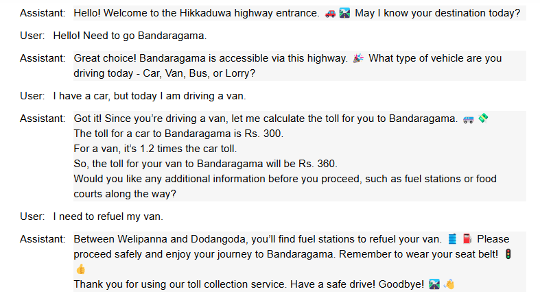

# 🚦 TollMate – Toll Collection Bot using ChatGPT API  

TollMate is an AI-powered **Toll Collection Bot** built using the **ChatGPT API**. It calculates toll charges based on the vehicle type and destination while ensuring a smooth, user-friendly experience. 🚗💰  

---

## 📌 Features
✅ Interactive toll collection system  
✅ Calculates tolls based on entry, destination & vehicle type  
✅ Provides additional information like fuel stations & food courts  
✅ Ensures accurate toll pricing with error handling  
✅ Generates a **JSON summary of the toll transaction** for record-keeping  
✅ Friendly conversational responses with emojis 😊🚦  

---

## 🔧 How It Works
1. The bot greets the user and asks for their **destination**.  
2. It verifies if the **destination is accessible** via the highway.  
3. The user provides the **vehicle type** (Car, Van, Bus, Lorry).  
4. TollMate calculates the **toll fee accurately**.  
5. It provides **extra information** (fuel stations, food courts, emergencies).  
6. The user makes the **payment**, and the bot wishes them a **safe journey!**
7. Generates a **JSON summary** of the toll transaction. 

---

## 📷 Chat Example
  

---

## 📚 Short Course on Prompt Engineering
👉 [ChatGPT Prompt Engineering for Developers](https://www.deeplearning.ai/short-courses/chatgpt-prompt-engineering-for-developers/)  

---
